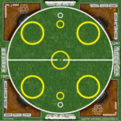

:figure-caption!:

[[gameComponents]]
== Composants du jeu
Chaque partie d'ElfBall nécessite quelques éléments très basique pour jouer à ce jeu rapidement et facilement.

----
== Game components
Every game of Elfball needs some very basic components to play the game quickly and easily.
----

=== Aire de jeu

.ElfBall l'aire de jeu
[.right.text-center]

Un peu de texte

----
=== Playing field
A standard Elfball field is a circle 21 paces in diameter (a pace is represented by one hex on the field). Within this circle are nine smaller circles. The centre circle is drawn around the exact centre of the field. In addition, there are two small goal circles in white at the edge of each side of the field. In front of each of the goal circles is a small yellow circle which is the Guardian circle for the player who protects the goal for your team. Finally there are four large yellow circles (two on each side of the field) which are the Rover circles and are the starting location for the players which will be the majority of your team. There are also two off-field areas to place players. One is your Bench where able players not playing are placed and one is your Recovery area where hard hit players must wait until after the next Test begins to return to the Bench area. When the game refers to the Infirmary, this means the player has been removed completely from the playing field for this game.
----
=== Ballon

----
=== Ball
The Elfball itself is designed to test the skill and in some part the luck of the game's players. It is constructed of a slightly oblong wooden sphere inside of a larger inflated oblong leather bladder which is greased before play. The internal sphere's irregular bouncing and spinning within the slippery cover make the overall ball quite difficult to throw, catch, and handle. While this can be frustrating for the players, it is quite exciting for the spectators. Still, veteran players learn to master the unusual properties of the ball to impressive effect. For purposes of marking the location of the ball on the field, a metal ball is included with the game.
----
=== Joueurs

----
=== Players
Impact! Miniatures sell a number of white metal miniatures to help you represent your players. However, any miniatures that you can put on a 25mm base (30mm for large players) to be properly representative of the players from your team are fine.
----
=== Dés
----
=== Dice
Elfball is normally played with six special Challenge dice and one 6-sided dice. A Challenge die has 4 different faces detailed in the next column.
----

[cols="^.^1a,<.^5"]
|===

| image::images/RTEmagicC_challenge_die_flop_10.jpg[Flop]
|This X symbol represents a flop. A flop is a failure and actually erases one success from your roll. Too many flops and bad things happen to your player trying to perform the action.

| image::images/RTEmagicC_challenge_die_blank_15.jpg[Blank]
|A blank face represents no result. While it is not a success, it is not a flop.

| image::images/RTEmagicC_challenge_die_star_11.jpg[Star]
|The star symbol represents a conditional success. It counts as a single success and allows you to roll an extra die.

| image::images/RTEmagicC_challenge_die_bullseye_23.jpg[Bullseye]
|The bull's-eye symbol represents a success towards the challenge being attempted.

|===

TIP: If you do not have Elfball Challenge dice you can use a normal D6 with the 1 being X, 2 & 3 are Blank, 4 as a Conditional Success, and 5 & 6 are a Success.

=== Gabarit de passe
----
=== Passing string
The game uses a 3/16" wide piece of string to show the hexes that can intercept when a throw is attempted.
----
=== Marqueurs
----
=== Counters
The game has two small yellow counters to use to track which player moved last for each team. The game also includes five white counters to be used to track Momentum, Potions, and the score during the game.
----
=== Entraineur
----
=== Team manager
You as the player of your team take on the roll of Team Manager. Any reference to the Team Manager in the rules is referring to you.
----
