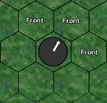

== Orientation du joueur
Chaque joueur a une face avant et arrière. Charger un adversaire dans le dos ou essayer de l'éviter quand il regarde dans la direction opposée est plus facile que le faire face à lui. Chaque fois qu'un joueur commence ou finit un mouvement, un défi ou une action, vous devez orienter les yeux du joueur dans la direction que vous voulez qu'il regarde. S'il est peu clair de déterminer où regarde un joueur (c.à-d. il regarde une ligne), l'entraîneur adverse peut décider à quel hexagone il fait face.

[.right.text-center]

L'orientation est déterminée sur la base de l'illustration de droite. L’hexagone que les yeux du joueur regardent et les 2 hexagones de chaque côté sont sa face avant. On considère tous les autres hexagones comme arrière.

----
 Player facing
Each player has a forward and rear facing. Hitting an opponent in the back or trying to get away from opponents looking the other way is easier to do than going head to head. Whenever a player starts or finishes any move, challenge or action, you must face the eyes of the player looking in the direction of the facing you want him to have. If it is unclear which way a player is facing (i.e. he is looking on a line), the opposing
coach may decide which hex he is facing.

Facing is determined based on the image to the right. The hex the player's eyes are looking at and the 2 hexes to each side of it are his front facing hexes. All other hexes are considered rear facing.
----
