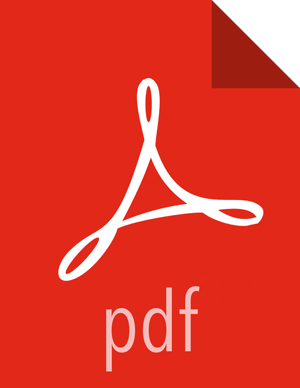

= ElfBall : Livre des régles, seconde édition. image:https://i.creativecommons.org/l/by/4.0/80x15.png[Licence, link="http://creativecommons.org/licenses/by/4.0/"]
:uri-github-repo: https://github.com/deild/elfball

Ce dépot concerne l'effort de traduction en français de la seconde édition des régles d'elfBall.

////
Voilà le livre de règle est terminé. Je ne suis pas mécontent d'avoir terminé, après un bon nombre d'heures passées dans l'espoir de donner accès au plus grand nombre à une version française digne de ce nom et surtout le plus proche possible de la version originale.
////

J'ai trouvé intéressant d'ajouter également quelques annexes, pour ceux qui passent de l'anglais au français régulièrement en consultant les sites dédiés, ceci permettra de connaître les termes ayant servi à cette traduction et leurs correspondances.

Bien sûr ce document est encore perfectible, et je compte sur vous, si vous y découvrez des coquilles, pour me les signaler afin de parfaire le document.

J'espère que ce document pourra rendre service aux francophones de tout pays et vous permettra de passer de bons moments avec ce merveilleux jeu qu'est elfball.

== Diffusion

Si vous travaillez ou souhaitez travailler sur la traduction française, faites le savoir, de sorte à ne pas dupliquer le travail.

== Workflow

Pour simplifier la gestion et utiliser pleinement les capacités de Git et Github, la manière la plus directe de contribuer consiste à dupliquer (_fork_) le dépôt *{uri-github-repo}* pour y générer vos modifications, si possible sur une branche thématique.

Ensuite, il suffit de fournir la contribution au dépôt originel en créant une requête de tirage (_Pull Request_). Ceci ouvre un fil de discussion avec possibilité de revue, pour que le propriétaire et le contributeur puissent discuter et modifier la proposition jusqu'à ce que le propriétaire soit satisfait du résultat et le fusionne dans le dépôt originel.

** http://pioupioum.fr/developpement/git-alias-productivite.html

== Comment générer le livre

Il y a deux façons de générer le livre aux formats PDF, ePub, Mobi et HTML.

La façon la plus facile est tout simplement de nous laisser le faire. Vous pouvez trouver la dernière publication en PDF, Mobi (format Kindle), ePub (format iBooks) ou HTML.

L'autre façon de générer les différentes versions du livre est de le faire manuellement avec Asciidoctor. Pour cela, vous devez installer les paquets `ruby` et `bundler` s'ils ne sont pas déjà installés.

Vous ne lancerez la commande suivante qu'une seule fois :

----
$ bundle install
----

Ensuite, lorsque de nouvelles versions sont publiées, vous générerez le livre aux formats PDF, Epub, Mobi et HTML avec la commande suivante :

----
$ bundle exec rake book:build
Converting to HTML...
 -- HTML output at elfball.html
Converting to EPub...
 -- Epub output at elfball.epub
Converting to Mobi (kf8)...
 -- Mobi output at elfball.mobi
Converting to PDF...
 -- PDF  output at elfball.pdf
----

Cela utilise les projets `asciidoctor`, `asciidoctor-pdf` et `asciidoctor-epub`.

Pour plus d'informations, veuillez vous référer à link:generer_livre.adoc[générer le livre].

== Références pour la traduction

=== Fichier glossaire

Le fichier glossaire.adoc tente de rassembler les traductions choisies pour les termes spécifiques à ElfBall.
Si d'autres termes nécessitent une uniformisation, il ne faut pas hésiter à les y ajouter.
De même, il est toujours possible de changer les termes déjà renseignés si une meilleure traduction est proposée.

L'uniformisation de la traduction par le respect de ce glossaire est une tâche permanente d'amélioration de la qualité finale du texte.

=== Glossaires généraux sur internet

Les glossaires de traduction disponibles sur Internet, sans être des références dogmatiques donnent des indications sur les termes les plus utilisés dans les documents français.

** http://glossaire.traduc.org/
** http://www.culturecommunication.gouv.fr/Politiques-ministerielles/Langue-francaise-et-langues-de-France/

=== Typographie française

La version française du livre se veut un document valant un document écrit nativement en français. À ce titre, la traduction doit suivre autant que possible les règles de typographie française en vigueur.

Voici ci-dessous quelques liens :

** http://www.dsi.univ-paris5.fr/typo.html
** http://jacques-andre.fr/faqtypo/lessons.pdf
