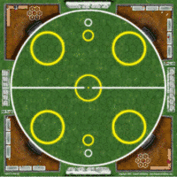

== Composants du jeu

Chaque partie d'elfBall nécessite quelques éléments très simples pour jouer au jeu rapidement et facilement.

=== Aire de jeu
[.right.text-left]
.ElfBall l'aire de jeu

Un terrain standard de elfball est un cercle de 21 cases de diamètre (une case est représentée par un hexagone sur le plateau). Dans ce cercle, il y a 9 autres cercles plus petits. Le cercle du centre est placé exactement au milieu du terrain. Il y a 2 autres petits cercles blanc, qui représentent les buts, placés chacun au fond d’une partie du terrain. Devant le petit cercle de but se trouve un autre petit cercle jaune, qui est la zone de départ du Garde qui protège les buts de votre équipe. Puis, il y a quatre larges cercles jaunes, deux de chaque coté du terrain, qui sont la zone de départ de la majorité de votre équipe. Il y a deux zones hors terrain pour placer ses joueurs. L'une est votre banc ou vous pouvez placer vos joueurs qui ne sont pas sur le terrain et l'autre votre zone de repos ou reste les joueurs touché jusqu'au prochain Test. Quand le jeu parle d'infirmerie les joueurs sont complètement enlevé du plateau pour ce match.

////
 Playing field
A standard Elfball field is a circle 21 paces in diameter (a pace is represented by one hex on the field). Within this circle are nine smaller circles. The centre circle is drawn around the exact centre of the field. In addition, there are two small goal circles in white at the edge of each side of the field. In front of each of the goal circles is a small yellow circle which is the Guardian circle for the player who protects the goal for your team. Finally there are four large yellow circles (two on each side of the field) which are the Rover circles and are the starting location for the players which will be the majority of your team. There are also two off-field areas to place players. One is your Bench where able players not playing are placed and one is your Recovery area where hard hit players must wait until after the next Test begins to return to the Bench area. When the game refers to the Infirmary, this means the player has been removed completely from the playing field for this game.
////

=== Ballon
La balle de Elfball est toute désignée pour tester les capacités des joueurs sur le terrain. Elle est construite d’une sphère en bois légèrement oblongue à l'intérieur d’une vessie en cuir gonflé qui est graissée avant le jeu. Elle rebondit irrégulièrement, glisse… Ce qui est assez énervant pour les joueurs, mais qui plait beaucoup au public.
La balle peut être représentée par n’importe quel objet de petite taille. Utiliser un ballon sculpté et peint est tout de même plus sympathique !

////
 Ball
The Elfball itself is designed to test the skill and in some part the luck of the game's players. It is constructed of a slightly oblong wooden sphere inside of a larger inflated oblong leather bladder which is greased before play. The internal sphere's irregular bouncing and spinning within the slippery cover make the overall ball quite difficult to throw, catch, and handle. While this can be frustrating for the players, it is quite exciting for the spectators. Still, veteran players learn to master the unusual properties of the ball to impressive effect. For purposes of marking the location of the ball on the field, a metal ball is included with the game.
////

=== Joueurs
Toutes les figurines que vous pourrez trouver en 25mm (ou 30mm pour les joueurs plus large) peuvent représenter sans problèmes les joueurs de votre équipe.

////
 Players
Impact! Miniatures sell a number of white metal miniatures to help you represent your players. However, any miniatures that you can put on a 25mm base (30mm for large players) to be properly representative of the players from your team are fine.
////

=== Dés
elfball se joue normalement avec 6 dés de défi particulier et un dé à 6 face. Un dé de défi a 4 faces différentes détaillées dans les colonnes suivantes.
////
 Dice
Elfball is normally played with six special Challenge dice and one 6-sided dice. A Challenge die has 4 different faces detailed in the next column.
////

 Le symbole X représente un fiasco. Un fiasco est un échec et efface un succès de votre jet. Trop de fiasco et de mauvaises choses arrivent à votre joueur essayant d'exécuter l'action.

[cols="^,<",frame="none",options="autowidth"]
|======
|  |Le symbole X représente un fiasco. Un fiasco est un échec et efface un succès de votre jet. Trop de fiasco et de mauvaises choses arrivent à votre joueur essayant d'exécuter l'action.

| image:images/RTEmagicC_challenge_die_blank_15.jpg[Blank] |Une face vide représente aucun résultat. Ce n’est ni un succès, ni  un fiasco.

| image:images/RTEmagicC_challenge_die_star_11.jpg[Star] |L'étoile représente un succès conditionnel. Ça compte pour un succès et vous permet de lancer un dé supplémentaire.

|  |Le symbole de l'œil de bœuf représente un succès.
|======

TIP: Si vous n'avez pas de dés défi ElfBall vous pouvez utiliser un D6 normal le 1 étant X, 2 & 3 sont vides, 4 comme succès conditionnel, et 5 & 6 sont un succès.

=== Gabarit de passe
Le jeu utilise une réglette en matière souple de 3/16" pour représenter les hexagones qui permettent d'interceptés quand un lancé est tenté.

=== Marqueurs
Deux petit marqueurs sont utilisés pour indiqué le dernier joueur en action de chaque équipe. 5 marqueurs sont aussi nécessaires durant le match pour tracer les Temps forts, les Potions et le score.

////
 Counters
The game has two small yellow counters to use to track which player moved last for each team. The game also includes five white counters to be used to track Momentum, Potions, and the score during the game.
////

=== Entraineur
Vous avez en tant que joueur le rôle d'entraîneur de votre équipe. Toute référence à l'entraîneur dans les règles se réfèrre à vous.
